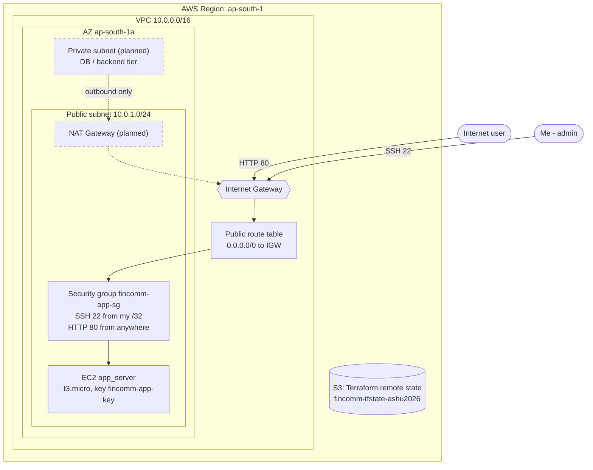

# FinComm Architecture (v1)

Solid = deployed via Terraform. Dashed = planned (see `docs/adr/20260830-ADR_nat-gateway.md`).

## Terraform mapping
| Diagram box | Resource | File |
|---|---|---|
| VPC | `aws_vpc.main` | `terraform/vpc_foundations/main.tf` |
| Public subnet | `aws_subnet.public` | same |
| Internet Gateway | `aws_internet_gateway.main` | same |
| Route table + association | `aws_route_table.public`, `aws_route_table_association.public` | same |
| Security group + rules | `aws_security_group.app_sg` + ingress/egress rules | `security_groups.tf` |
| EC2 | module `ec2-instances` | `terraform/ec2_app/` |
| Remote state | S3 backend; EC2 project reads VPC outputs via `terraform_remote_state` | both projects |

## Two-project flow
`vpc_foundations` applies first and exports `public_subnet_id` and `app_sg_id`. `ec2_app` reads those outputs and launches the EC2 instance into that subnet and SG.
